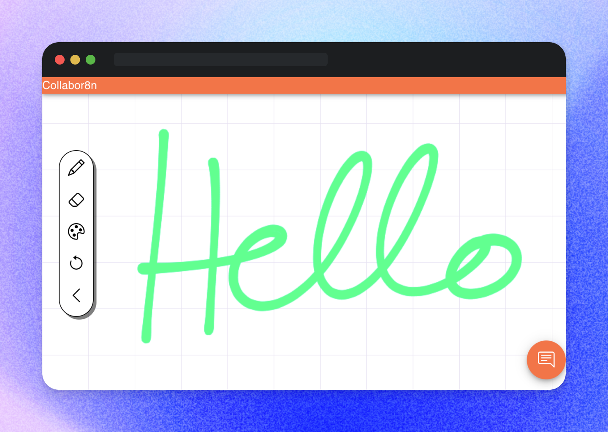

# Collabor8n

[](LICENSE)

Collabor8n is a real-time, collaborative whiteboard platform that enables teams to draw, take notes, chat, and brainstorm together. Built using React, Node.js, Express, and MongoDB, Collabor8n provides an intuitive and interactive experience for users to collaborate effectively.  
  
  
<p align="center">
  
</p>

## Live Demo
You can see a live demo of Collabor8n at https://whiteboard.ericwli.com

## Features

- Real-time drawing and collaboration using WebSockets via socket.io
- Chat functionality
- User authentication using JSON Web Tokens (JWT)
- API service to save whiteboard drawings and manage sharing
- Dashboard to see all of your saved drawings

## Built With
- React
- Node.js
- Express
- MongoDB
- Socket.io
- Material UI

## Getting Started

To setup the project on your local machine, follow these instructions

### Prerequisites

- [Node.js](https://nodejs.org/en/)
- [MongoDB](https://www.mongodb.com/) or [MongoDB Atlas](https://www.mongodb.com/atlas/database)

### Installation

1. Clone the repository and navigate to the project directory

```
git clone https://github.com/EricWLi/Collabor8n.git
cd Collabor8n
```

2. Install the required NPM packages
```
npm install
```

3. Create a .env file with the following environment variables.  
If you are using MongoDB Atlas, [this guide](https://www.mongodb.com/docs/guides/atlas/connection-string/) will show you how to find your connection string. Your JWT secret key should be 256 bits or larger.
```
 MONGO_CONN="<mongodb-connection-string>"
 JWT_SECRET="<jwt-secret-key>"
 PORT=<port>
```

4. Build the React web application
```
npm run build
```

5. Start the Node.js/Express server
```
npm run start
```

6. You should be able to access Collabor8n locally from the port that you defined in your environment variables.
